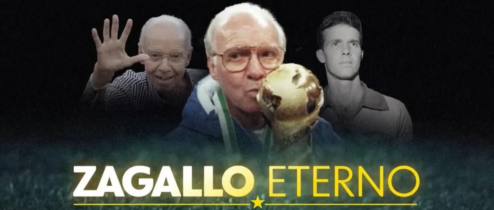

    

# Visão Geral:
Este site é uma homenagem ao lendário treinador e jogador de futebol brasileiro, Mário Jorge Lobo Zagallo, mais conhecido como Zagallo. Aqui, exploramos a vida, carreira e conquistas deste ícone do futebol mundial. Zagallo é uma figura icônica, tendo deixado uma marca indelével não apenas no cenário do futebol brasileiro, mas também internacionalmente.

## Conteúdo:
O site está dividido em seções que abrangem diferentes aspectos da vida e carreira de Zagallo:

1. História: Explore a vida desde os primeiros anos até as realizações mais significativas de Zagallo, incluindo informações sobre seu início no futebol e ascensão como jogador e treinador.

2. Títulos: Explore as conquistas mais notáveis de Zagallo como jogador e treinador, incluindo títulos nacionais e internacionais.

## Sobre:
Este site é uma iniciativa dedicada a preservar e celebrar a vida e o legado de Zagallo para as gerações presentes e futuras de amantes do futebol. Esperamos que você desfrute da jornada através da vida deste verdadeiro ícone do esporte.

## 🚀 Tecnologias Utilizadas
Este site foi desenvolvido utilizando as seguintes tecnologias:

- ReactJS: https://react.dev/learn
- React Router Dom: https://reactrouter.com/en/main